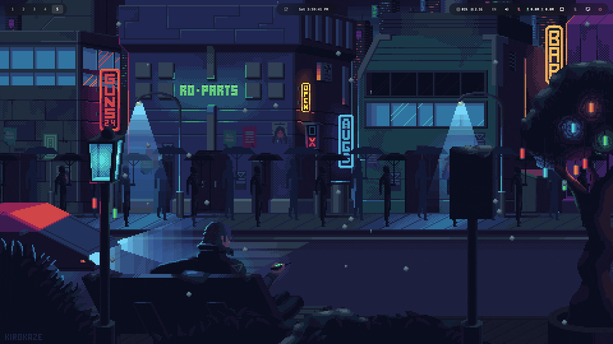

# CachyOS Hyprland Environment — Dotfiles

> Modular, reproducible, and hardware-portable **Onyx & Platinum** monochrome Hyprland desktop environment powered by **Chezmoi** and **Lua**.



---

## Quick Start & Reproduction

To reproduce this exact environment on any fresh CachyOS or Arch Linux installation:

```bash
# 1. Install chezmoi and git
sudo pacman -S --needed chezmoi git

# 2. Initialize and apply dotfiles
chezmoi init --apply BodzTH/hyprconfigs

# 3. Run the bootstrap script to install all packages and enable services
~/.local/share/chezmoi/scripts/bootstrap.sh
```

---

## System & Application Stack

| Component | Choice | Description |
| :--- | :--- | :--- |
| **OS / Kernel** | [CachyOS](https://cachyos.org/) | Optimized Arch-based rolling distro (`linux-cachyos`) |
| **Compositor** | [Hyprland](https://hyprland.org/) | Modular Lua configuration (`hyprland.lua`) |
| **Session Manager** | [UWSM](https://github.com/Vladimir-csp/uwsm) | Universal Wayland Session Manager with systemd integration |
| **Status Bar & UI** | [QuickShell](https://quickshell.outfoxxed.me/) | Custom QML bar, app launcher, clipboard, and notifications |
| **Terminal** | [Ghostty](https://ghostty.org/) / [Kitty](https://sw.kovidgoyal.net/kitty/) | Modern GPU-accelerated terminals |
| **Shell** | [Fish](https://fishshell.com/) | Modular `conf.d/` + `functions/` with [Starship](https://starship.rs/) prompt |
| **Editor** | [Neovim](https://neovim.io/) | Custom [NvChad](https://nvchad.com/) setup with Treesitter & LSP |
| **File Manager** | [Yazi](https://yazi-rs.github.io/) | Blazing fast terminal file manager |
| **Wallpaper** | [awww](https://github.com/awww-project/awww) | Dynamic wallpaper daemon with smooth transitions |
| **Lock Screen** | [hyprlock](https://wiki.hypr.land/Hypr-Ecosystem/hyprlock/) | Onyx & Platinum minimal lock screen |
| **Idle Daemon** | [hypridle](https://wiki.hypr.land/Hypr-Ecosystem/hypridle/) | Automated screen blanking & DPMS |
| **Theming** | Onyx & Platinum | Monochrome palette with Catppuccin Mocha Dark cursors |

---

## Hardware Portability System

This repository dynamically adapts to different hardware configurations (monitors, GPUs, device sensitivities) without polluting common configs.

### 1. Hyprland Host Profiles (`~/.config/hypr/hosts/`)
Hyprland automatically queries the machine hostname at startup and loads `~/.config/hypr/hosts/<hostname>.lua`. If no profile exists, it seamlessly falls back to `~/.config/hypr/hosts/default.lua`.

```
~/.config/hypr/hosts/
├── init.lua              # Dynamic host profile loader
├── default.lua           # Sane fallback (auto display detection)
└── hyprcachyos.lua       # Main desktop profile (1080p@165Hz, G305 flat accel, app paths)
```

#### Adding a New Machine (e.g., Laptop):
Create `~/.config/hypr/hosts/<your-hostname>.lua`:
```lua
return {
    monitors = {
        { output = "eDP-1", mode = "1920x1200@60Hz", position = "0x0", scale = 1 },
    },
    apps = {},
    devices = {
        { name = "synps/2-synaptics-touchpad", sensitivity = 0.2 },
    },
}
```

### 2. Environment Variables & GPU Profiles (`~/.config/uwsm/`)
UWSM environment files are managed with Chezmoi Go templates (`dot_config/uwsm/env.tmpl` and `dot_config/uwsm/env-hyprland.tmpl`).
- **AMD**: Activates RADV, `radeonsi`, DXVK device filter, and dual-GPU AQ_DRM_DEVICES.
- **NVIDIA**: Activates `nvidia-drm`, `__GLX_VENDOR_LIBRARY_NAME=nvidia`, and `NVD_BACKEND=direct`.
- **Intel**: Activates `iHD` VA-API drivers.

---

## Categorized Package Manifests

Packages are split into logical manifests in `packages/`:

| Manifest | Purpose |
| :--- | :--- |
| `00-cachyos-base.txt` | Core system, CachyOS kernels, filesystem tools, bootloader |
| `10-hyprland.txt` | Hyprland ecosystem, QuickShell, screen capture (`grim`, `slurp`, `satty`), daemons |
| `20-apps.txt` | User GUI & CLI applications (Firefox, Obsidian, OBS, Inkscape, Neovim, etc.) |
| `30-shell.txt` | Fish, Starship, Yazi, Bat, Eza, Fzf, Ripgrep, Zoxide, Btop |
| `40-terminals.txt` | Ghostty and Kitty |
| `50-fonts.txt` | Nerd fonts, Cantarell, Noto, Cascadia Code |
| `60-audio-media.txt` | Pipewire, Wireplumber, ALSA, GStreamer codecs |
| `70-theming.txt` | Kvantum, Qt5ct, Qt6ct, Nwg-look, GTK stylesheets |
| `80-gpu-amd.txt` | Vulkan Radeon, OpenCL Mesa, AMDGPU drivers |
| `90-networking.txt` | NetworkManager, Bluetooth, OpenSSH, UFW, wireless tools |
| `95-extra.txt` | LaTeX, TeXLive, and supplementary utilities |

---

## Keybinding Highlights

| Keybinding | Action |
| :--- | :--- |
| <kbd>SUPER</kbd> + <kbd>T</kbd> | Launch Ghostty terminal |
| <kbd>SUPER</kbd> + <kbd>E</kbd> | Launch Yazi file manager |
| <kbd>SUPER</kbd> + <kbd>F</kbd> | Launch Firefox |
| <kbd>SUPER</kbd> + <kbd>C</kbd> | Launch Neovim (NvChad) |
| <kbd>SUPER</kbd> + <kbd>A</kbd> | Toggle QuickShell App Launcher |
| <kbd>SUPER</kbd> + <kbd>Space</kbd> | Toggle QuickShell Wallpaper Selector |
| <kbd>SUPER</kbd> + <kbd>V</kbd> | Toggle QuickShell Clipboard Panel |
| <kbd>SUPER</kbd> + <kbd>Backspace</kbd> | Toggle QuickShell Power Menu |
| <kbd>SUPER</kbd> + <kbd>S</kbd> | Drop-down Scratchpad Terminal |
| <kbd>SUPER</kbd> + <kbd>N</kbd> | Drop-down Notes (Obsidian) |
| <kbd>SUPER</kbd> + <kbd>Shift</kbd> + <kbd>W</kbd> | Transition Wallpaper (`awww`) |
| <kbd>F11</kbd> | Fast region screenshot → clipboard (`grim` + `slurp`) |
| <kbd>F12</kbd> | Annotate screenshot (`grim` + `slurp` + `satty`) |

---

## Dotfiles Management Cheatsheet

```bash
# Check modified files against repo
chezmoi status
chezmoi diff

# Edit a managed file
chezmoi edit ~/.config/hypr/hyprland.lua

# Add a newly created configuration file
chezmoi add ~/.config/newapp/config

# Re-apply repository state to the system
chezmoi apply

# Commit and push changes to GitHub
chezmoi cd
git add .
git commit -m "Update configurations"
git push
```

---

## Updating the Showcase Screenshot

Whenever you update your wallpaper or styling, run:
```bash
~/.local/share/chezmoi/scripts/showcase.sh
chezmoi cd && git commit -am "Update preview screenshot" && git push
```
